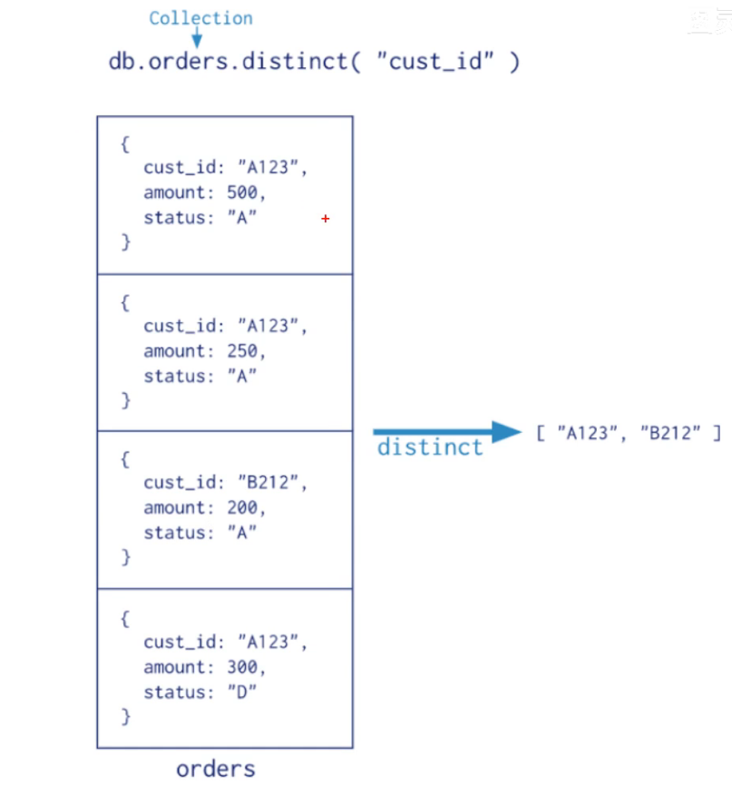
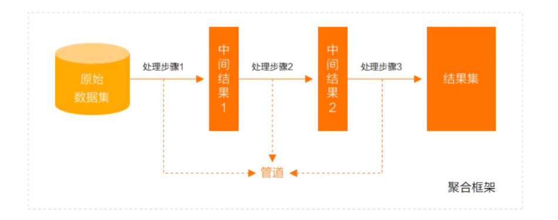
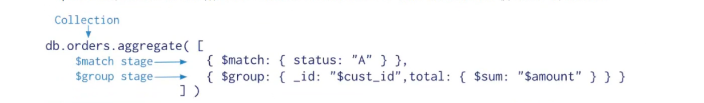
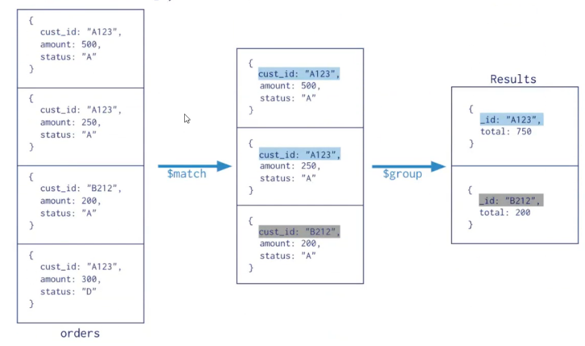

# mongodb的聚合操作

聚合操作处理数据记录并返回计算结果(诸如统计平均数，求和等)，可以对分组数据执行各种分组操作以返回单个结果

> 聚合一共分为三类：单一作用聚合，管道聚合，MapReduce

- 单一作用集合:提供了对常见的聚合过程的简单访问、操作都是从单个集合聚合文档
- 聚合管道是一个数据聚合框架，模型基于数据处理流水的概念。文档进入多级管道，将文档转换为聚合结果
- MapReduce操作具有两个阶段，处理每个文档每个输入文档发射一个或多个对象的map阶段，以及reduce组合map操作的输出阶段

# 单一集合

- distinct({条件})  去重
- estimatedDocumentCount()  忽略查询条件计数
- count({条件}) 计数

> 单一集合缺乏了集合管道和map-reduce的灵活度和功能

# 聚合管道

> mongoDB聚合框架是一个计算框架他可以

- 作用在一个或多个集合上
- 对集合中的数据进行一些系列运算
- 将这些数据转换为期望形式

从效果而言相当于SQL里面的group by 、left join 、as 等

## 管道(pipeline)和阶段（stage)

> 语法  db.collection.aggregate([{$stage1,$stage2}],{options})

- 一个管道包含多个阶段
- 每个阶段可以在管道中出现多次
- options：可选，聚合操作的其他参数。包含查询计划，是否使用临时文件、游标、最大操作时间、读写策略等，强制索引等

-  常用的管道聚合

| 阶段           | 描述     | SQL等价运算符 |
| -------------- | -------- | ------------- |
| $match         | 筛选条件 | WHERE         |
| $project       | 投影     | AS            |
| $lookup        | 左外连接 | JOIN          |
| $sort          | 排序     | ORDER BY      |
| $group         | 分组     | GROUP BY      |
| $skip/$limit   | 分页     |               |
| $unwind        | 展开数组 |               |
| $graphLookup   | 图搜索   |               |
| $facet/$bucket | 分片搜索 |               |

